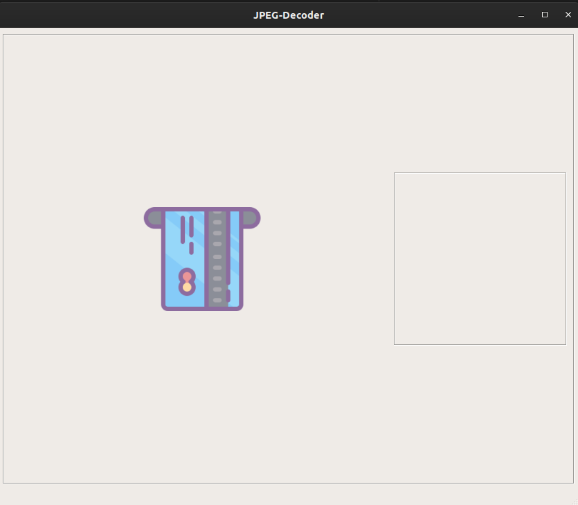
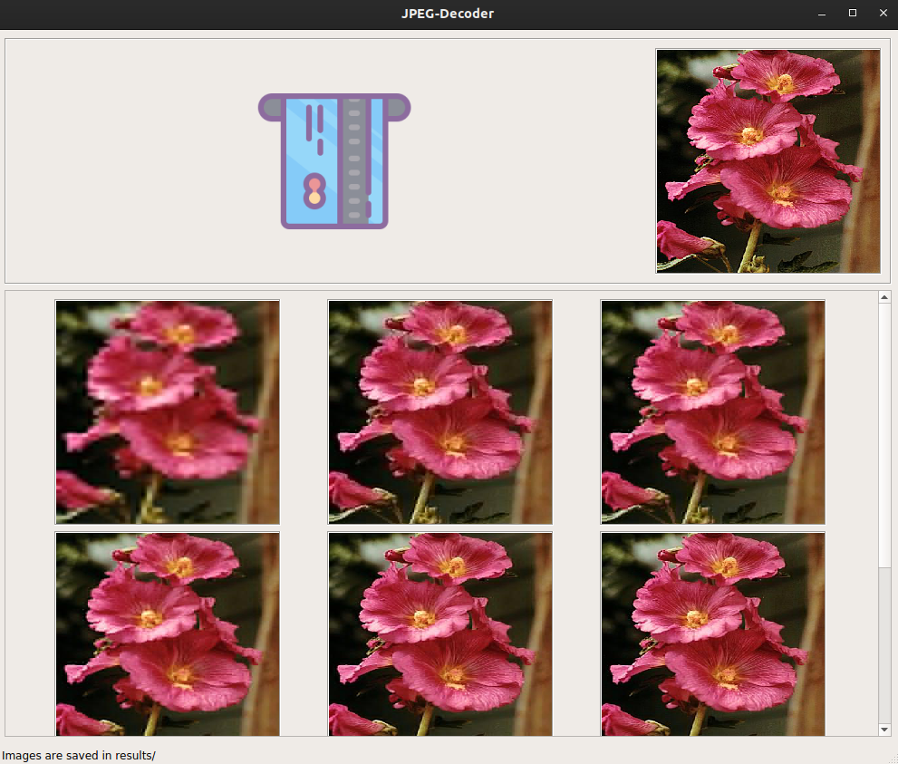

# JPEG Decoder

Decoder application that provides a basic visualization of progressive jpegs and emphasizing on the importance of such an algorithm.

## <u>Decoding</u> 

JPEG file consists of a simple successions of markers, listing a few :

| Marker | Hex         | Description                                                  |
| ------ | ----------- | ------------------------------------------------------------ |
| SOS    | b'\xff\xda' | Start of Scan marker, indicates the following binary as a scan from image |
| SOF2   | b'\xff\xc2' | Progressive DCT, indicates a progressive image               |
| DHT    | b'\xff\xc4' | Define Huffman table                                         |
| EOI    | b'\xff\xd9' | End of image                                                 |
| SOF0   | b'\xff\xc0' | Baseline DCT, indicates a normal baseline jpeg               |

all markers could be found easily on [wikipedia](https://www.google.com) here are list of important ones that we used.

Progressive JPEGs are very close to a baseline JPEG the only difference is that it consists of multiple scans with multiple dht encodings. Extracting each scan will result in a slightly enhanced image that the one before. Our algorithm simple extract each scan included in a progressively encoded picture and decode using the help of `pil.Image.JpegImagePlugin` which receives the binary buffer and decode the image. 

## <u>Basic Usage</u>

Decoder application is of simple use and a friendly interface, just load a Progressive JPEG image and you are good to go. Images extracted are saved in `./results` with some tests provided in `./tests`.

 

